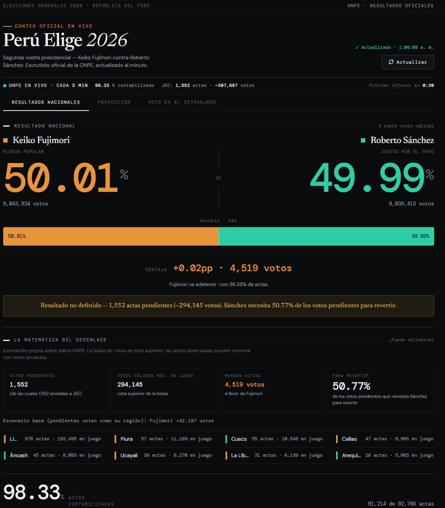

# 🇵🇪 Peru Elige 2026
### Real-Time Election Analytics Platform

A real-time analytics platform built to monitor, validate, visualize, and forecast Peru's 2026 presidential runoff election using official ONPE data.

🔴 Live election monitoring  
📊 Historical trend tracking  
🗺️ Regional vote analysis  
⚡ Automated data validation  
📈 Outcome forecasting  
🔄 Near real-time updates

---

## Live Dashboard

👉 **Dashboard:** https://mrsprintalot.github.io/Peru_Elecciones_2026_2da/

---

## Project Overview

Election results arrive gradually throughout election night as polling stations submit their official vote counts.

The challenge is not simply displaying percentages. Decision-makers, journalists, analysts, and citizens need to understand:

- Who is leading?
- Is the lead growing or shrinking?
- Which regions are driving the result?
- How stable is the trend?
- How much uncertainty remains?
- Are all official data sources reporting consistently?

This project transforms raw election data into actionable insights through automated ingestion, validation, historical tracking, forecasting, and interactive visualization.

---

## Why This Project Matters

Election nights generate large volumes of partial and constantly changing information.

Raw vote counts alone provide limited context. This platform was designed to answer higher-value analytical questions:

- How is the election evolving over time?
- Which regions explain the national result?
- Are reporting patterns consistent?
- Can we estimate the likely final outcome before 100% of votes are counted?

The goal is transparency, data quality, and insight generation using official public data.

---

# Dashboard Preview



---

# Skills Demonstrated

## Business Analysis

- Trend analysis
- Forecasting
- Data validation
- KPI design
- Stakeholder-focused reporting
- Geographic performance analysis
- Executive dashboard design

## Data Analytics

- Real-time metrics
- Historical trend monitoring
- Statistical reasoning
- Exploratory analysis
- Data interpretation
- Variance analysis

## Data Engineering

- API ingestion
- Automated refresh workflows
- Data quality controls
- Snapshot tracking
- Cache optimization
- Data normalization

## Data Visualization

- Interactive dashboards
- Geographic visualizations
- Time-series analysis
- Information hierarchy design
- Decision-oriented reporting

---

# Recruiter Playbook

## Business Problem

Election results are released progressively as polling stations report their vote counts.

Stakeholders need a reliable way to monitor trends, understand regional dynamics, validate official reporting, and estimate likely outcomes before the final count is complete.

---

## Approach

1. Retrieve official election results from ONPE APIs
2. Normalize incoming datasets
3. Validate national and regional consistency
4. Archive historical snapshots
5. Monitor trend evolution
6. Generate visual insights
7. Estimate final outcomes based on reporting progress

---

## Key Insights Generated

- National vote distribution
- Regional voting patterns
- Vote-count progression
- Lead stability analysis
- Historical trend evolution
- Official data consistency monitoring

---

## Business Value

- Faster interpretation of election trends
- Increased transparency
- Better understanding of regional voting behavior
- Continuous monitoring of official reporting
- Data-driven election analysis

---

# Technical Deep Dive

## Architecture

```text
Official ONPE APIs
        │
        ▼
Cloudflare Worker
        │
        ▼
Data Validation Layer
        │
        ▼
Historical Snapshot Engine
        │
        ▼
Forecasting Logic
        │
        ▼
Interactive Dashboard
        │
        ▼
GitHub Pages Deployment
```

---

## Data Sources

### Primary Source

- Official ONPE Election Results API

### Supporting Sources

- Regional election endpoints
- JEE (Jurado Electoral Especial) reporting data

---

## Data Quality Controls

The platform performs validation checks to identify:

- Missing regional records
- National vs regional discrepancies
- Invalid vote totals
- Reporting delays
- Inconsistent aggregation results

Real-world datasets are rarely perfect. Detecting anomalies is often as important as visualizing the data itself.

---

## Historical Tracking

Election data is periodically archived to create a historical timeline of reporting progress.

This enables:

- Trend analysis
- Vote evolution monitoring
- Forecasting
- Post-election analysis

---

## Forecast Methodology

The forecasting component evaluates:

- Current vote distribution
- Reporting progress by region
- Historical evolution patterns
- Remaining uncounted votes

The objective is not to predict voter behavior.

The objective is to estimate likely final outcomes based on official results already reported.

---

## Technology Stack

### Frontend

- HTML5
- CSS3
- JavaScript

### Visualization

- Chart.js
- SVG Maps

### Data Layer

- ONPE APIs
- Cloudflare Workers

### Deployment

- GitHub Pages

### Version Control

- Git
- GitHub

---

# AI-Assisted Development

This project was developed using a modern AI-assisted workflow with **Claude Code (Opus 4.8)**.

AI accelerated implementation and iteration speed, while project direction, analytical logic, validation requirements, testing, and final decision-making remained human-driven.

### My Responsibilities

- Product vision
- Feature definition
- Data source research
- Validation logic design
- Forecasting requirements
- Dashboard UX decisions
- Quality assurance
- Testing and verification
- Deployment and maintenance

### AI-Assisted Responsibilities

- Code generation
- Refactoring
- Boilerplate implementation
- Documentation drafting
- Rapid prototyping

This reflects the increasingly common Human + AI workflow used in modern software, analytics, and product development.

---

# Challenges Solved

## Data Consistency

Official national and regional datasets occasionally reported discrepancies.

A validation layer was implemented to identify, track, and surface potential inconsistencies.

---

## Near Real-Time Updates

The dashboard refreshes automatically while balancing responsiveness and API utilization.

---

## Historical Persistence

Official election APIs focus on current results.

A snapshot system was implemented to preserve historical states for trend analysis and forecasting.

---

## Information Density

Election data contains thousands of records and multiple aggregation levels.

The dashboard was designed to surface the most important insights without overwhelming users.

---

# Lessons Learned

This project reinforced several real-world analytics skills:

- Working with imperfect data
- Designing stakeholder-friendly dashboards
- Building validation frameworks
- Communicating uncertainty responsibly
- Managing near real-time data flows
- Combining analytics with product thinking
- Leveraging AI-assisted development effectively

---

# Future Improvements

- More advanced forecasting models
- Department-level drilldowns
- Historical election comparisons
- Additional anomaly detection rules
- Exportable reports
- Mobile-first optimizations

---

# About Me

## Rafael Vasquez

Business Analyst | Data Analyst | BI Analyst

8+ years of experience transforming data into business decisions through analytics, automation, reporting, and process improvement.

### Core Skills

- SQL
- Power BI
- Excel
- Azure Data Factory
- Data Analytics
- Business Analysis
- Dashboard Development
- Process Automation

### Links

- LinkedIn: https://linkedin.com/in/TU-LINKEDIN
- GitHub: https://github.com/MrSprintALot

---

### Disclaimer

This project is an independent analytical and educational initiative.

Election data belongs to the corresponding official public institutions. Results displayed are sourced from official ONPE reporting systems.
